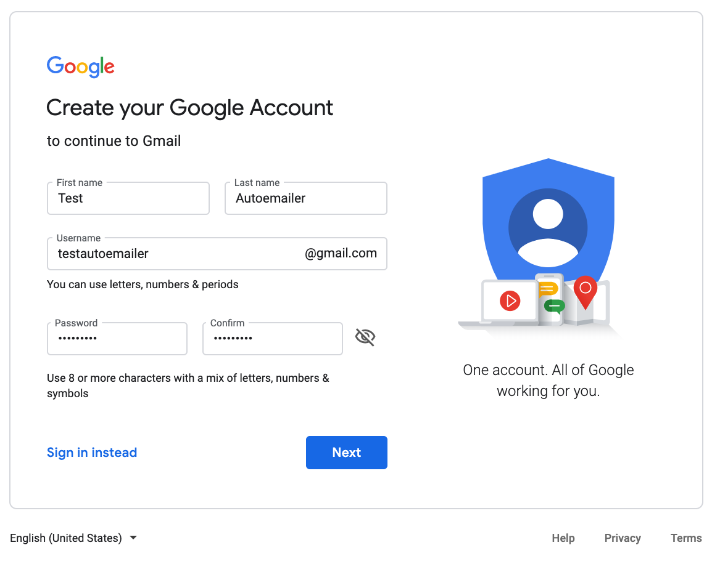
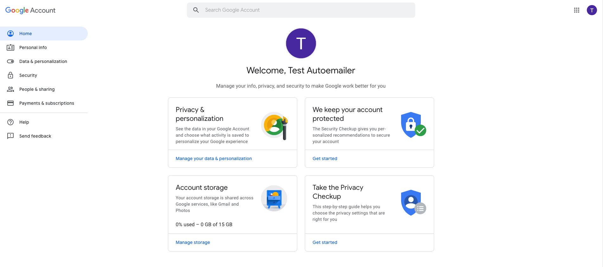
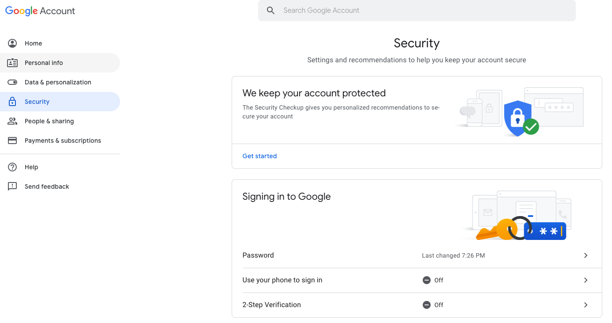
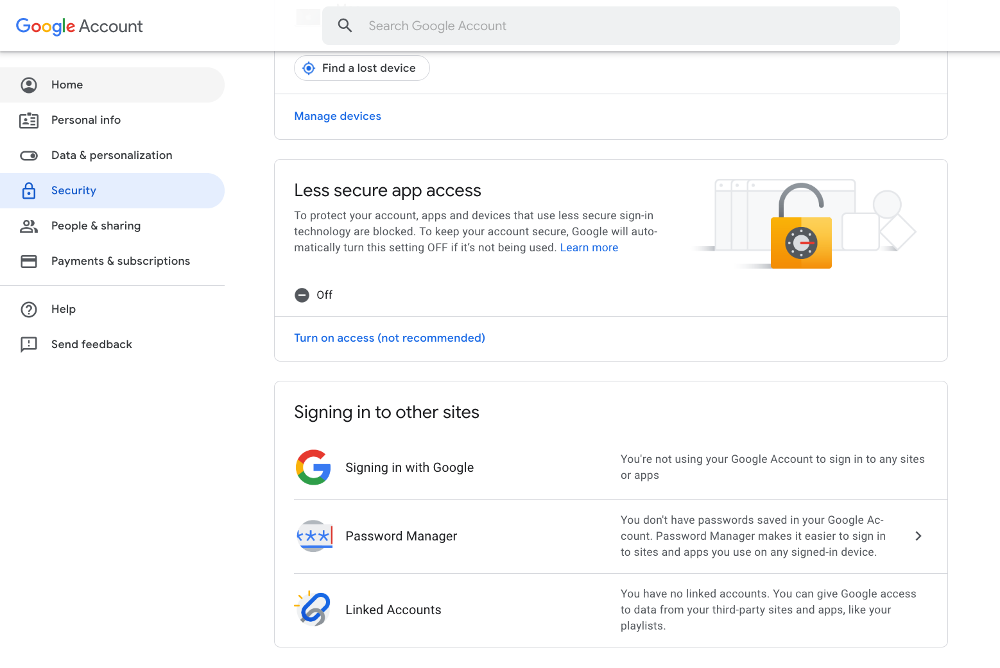
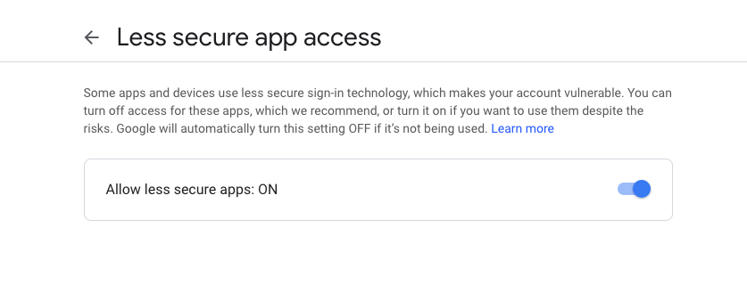

Quickstart
==========
Getting start with auto-emailer is easy, but requires a few simple steps.

The examples in this Quickstart guide will use the Gmail SMTP server to send
emails, but the same principles apply to other email services. Although the
majority of email providers use the same connection ports as the ones in this
tutorial, you can run a quick Google search to confirm yours.

Setting up an Email
-------------------

Before you use auto-emailer, you'll need to have an email provider. To get
started with this tutorial, I'll walk you through setting up a Gmail account.
A nice feature of Gmail is that you can use the + sign to add any modifiers to
your email address, right before the @ sign. For example, mail sent to
testautoemailer+test1@gmail.com and testautoemailer+test2@gmail.com will both
arrive at testautoemailer@gmail.com. When testing email functionality, you can
use this to emulate multiple addresses that all point to the same inbox.

To set up a Gmail address for testing your code, do the following:

Create a new Google account
"""""""""""""""""""""""""""
First step is to open a web browser and create a new `gmail account
<https://accounts.google.com/signup/>`_.

Account Settings
""""""""""""""""
Once you have created an account, navigate to the account settings page by
clicking the circle logo in the upper right corner.

Account Security
""""""""""""""""
Inside of the account settings page, click on the `Security` section located on
the left menu.

Less Secure Apps
""""""""""""""""
In the account security page, scroll down until you see "Less secure app access"
box. Click on the link `Turn on access (not recommended)
<https://myaccount.google.com/lesssecureapps>`_.

Turn Allow less secure apps to ON. Be aware that this makes it easier for
others to gain access to your account.

If you don’t want to lower the security settings of your Gmail account, check
out Google’s `documentation
<https://developers.google.com/gmail/api/quickstart/python>`_ on how to gain
access credentials for your Python script, using the OAuth2 authorization
framework.

Installation
------------

Install the latest auto-emailer release via pip::

    pip install auto-emailer

You may also install a specific version::

    pip install auto-emailer==1.0.0

.. note:: The latest development version can always be found on GitHub_.
.. _GitHub: https://github.com/adamstueckrath/auto-emailer/

Credentials
-----------

To get started either explicitly pass arguments to
:class:`~auto_emailer.config.crendentials.Credentials` to authenticate your
SMTP client or you can set the environment variables ``EMAILER_SENDER``
*AND* ``EMAIL_PASSWORD`` for auto configuration. In most cases, these two
environment variables will be enough, but if authentication is failing then you
may need to further specify the environment variables ``EMAILER_HOST`` and
``EMAILER_PORT``.

This library provides no support for obtaining user credentials, but does
provide support for using user credentials. This way you don’t have to worry
about accidentally pushing sensitive credentials to a place such as GitHub and
you can easily and securely authenticate the SMTP client within your code. The
auto-emailer environment variables all start with ``EMAILER_``.

Using auto-emailer
------------------

To use auto-emailer, you must first import it::

    from auto_emailer import Emailer, Message

    # auto-configuration of credentials to
    # authenticate smtp server
    mailer = Emailer(config=None, delay_login=False)

Now that you have an emailer client, you can create a message object to send
from the client. The following uses the Message class to create an
email message::

    # create a message
    my_email = Message('my_email@test.com',
                       ['my_friend@gmail.com'],
                       'Hello Friend!')

It's easy to draft an email message once you have an instance of the Message
class. For example, the following creates the text of an email message and then
send the email::

    # draft a message
    my_email = my_email.draft_message(text="Hi! Let's hang out 😁")

    # send email message to friend!
    mailer.send_email(my_email)

Tips and Tricks
---------------

- Reference the email provider (host) for more information on bandwidth limits
  for accounts.
- Reference the email provider (host) for more information on sending limits.
- Do not send too fast.
- Do not send more than 50 emails at once or use ``time.sleep()`` in between
  each email.
- Do not try stupid things or your email provider will punish you.

